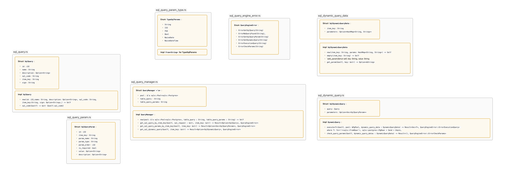

# 📦 `query_engine` – Exécution dynamique de requêtes SQL avec `sqlx`

Le module `query_engine` vous permet d'exécuter dynamiquement des requêtes SQL stockées en base de données avec validation de paramètres typés. Il s'appuie sur `sqlx` et fonctionne avec une base PostgreSQL.

Ce module est **fonctionnel** pour une utilisation concrète, bien qu'il puisse être étendu avec d'autres fonctionnalités (caching, audit, logs, contrôle de sécurité...).

---

## 🧰 Prérequis

Vous devez disposer d'une base de données **PostgreSQL** contenant deux tables avec les schémas suivants :

### Table `sql_query`

| Champ           | Type             | Description                            |
| --------------- | ---------------- | -------------------------------------- |
| `id`          | `BIGINT`       | Clé primaire                          |
| `name`        | `VARCHAR(255)` | Nom lisible de la requête             |
| `description` | `TEXT`         | Description optionnelle                |
| `sql_code`    | `TEXT`         | Le code SQL à exécuter               |
| `item_key`    | `VARCHAR(255)` | Identifiant unique pour l'appel        |
| `sign`        | `VARCHAR(255)` | Signature de sécurité ou autre usage |

### Table `sql_query_param`

| Champ           | Type             | Description                                   |
| --------------- | ---------------- | --------------------------------------------- |
| `id`          | `BIGINT`       | Identifiant                                   |
| `item_key`    | `VARCHAR(255)` | Clé étrangère vers `sql_query(item_key)` |
| `param_name`  | `VARCHAR(255)` | Nom du paramètre                             |
| `param_type`  | `VARCHAR(255)` | Type (BOOLEAN, INTEGER, TEXT, etc.)           |
| `param_order` | `INTEGER`      | Ordre d’apparition dans la requête          |
| `is_required` | `BOOLEAN`      | Paramètre requis ou non                      |
| `value`       | `VARCHAR(255)` | Valeur par défaut (nullable)                 |
| `description` | `TEXT`         | Description optionnelle                       |

---

## 🚀 Comment l'utiliser ?

### 1. Établir une connexion PostgreSQL

```rust
let pool = PgPoolOptions::new()
    .max_connections(1)
    .connect("postgres://postgres:a2020@pg:5432/aeveil")
    .await
    .expect("Failed to connect to the database");
```

---

### 2. Instancier le gestionnaire de requêtes dynamiques

```rust
let manager = SqlQueryManager::new(
    &pool,
    "data_analyst.queries".to_string(), // Table des requêtes SQL
    "data_analyst.parameters".to_string(), // Table des paramètres des requêtes SQL
);
```

---

### 3. Préparer les paramètres

```rust
let datas_from_front = SqlDynamicQueryData::new(
    "select.atelier".to_string(), // item_key de la requête
    vec![
        ("id".to_string(), "123".to_string()), // paramètre de la requête
    ].into_iter().collect()
);
```

---

### 4. Récupérer la requête SQL dynamique

```rust
let result = manager.get_sql_dynamic_query(&datas_from_front.item_key).await;
let dynamic_query = result.unwrap().expect("Aucune requête trouvée");
```

---

### 5. Définir une structure de destination pour les résultats

```rust
#[derive(Debug, sqlx::FromRow)]
struct Atelier {
    id: i32,
    item_name: String,
}
```

---

### 6. Exécuter la requête dynamique

```rust
dynamic_query.execute::<Atelier>(&pool, datas_from_front)
    .await
    .expect("L'exécution de la requête devrait réussir");
```

---

## ✅ Ce que vous obtenez

- Séparation claire des requêtes et de leur logique dans la base de données
- Typage sécurisé via `sqlx::FromRow`
- Validation dynamique des paramètres avant exécution

---

## ✨ Améliorations possibles

- Améliorer la gestion des erreurs
- Terminer l'interface CRUD
- Système d'autorisations par signature

---

## Résumé


# sql_query_engine
